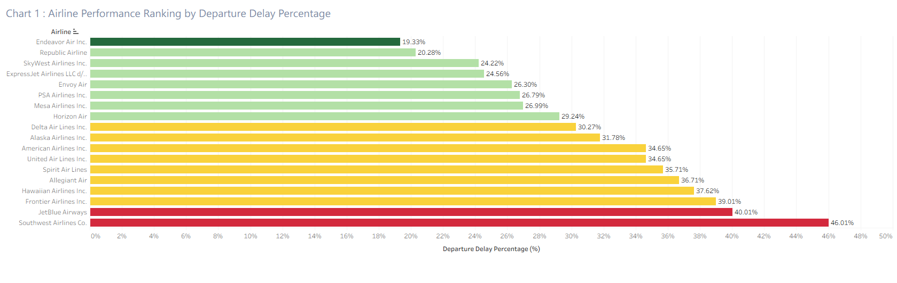
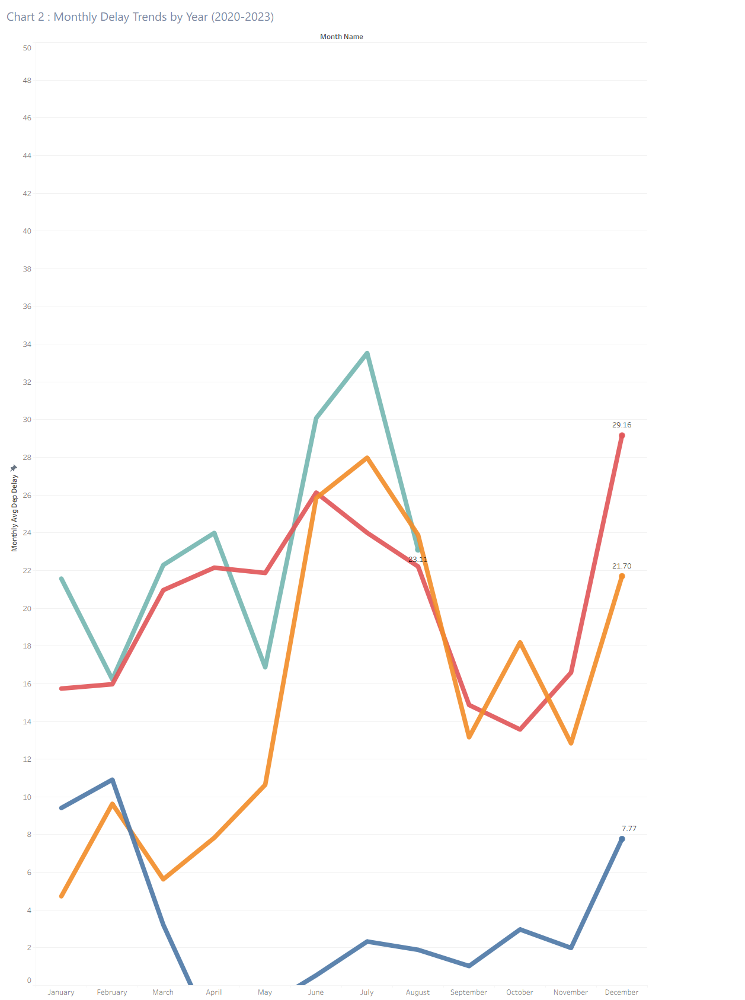
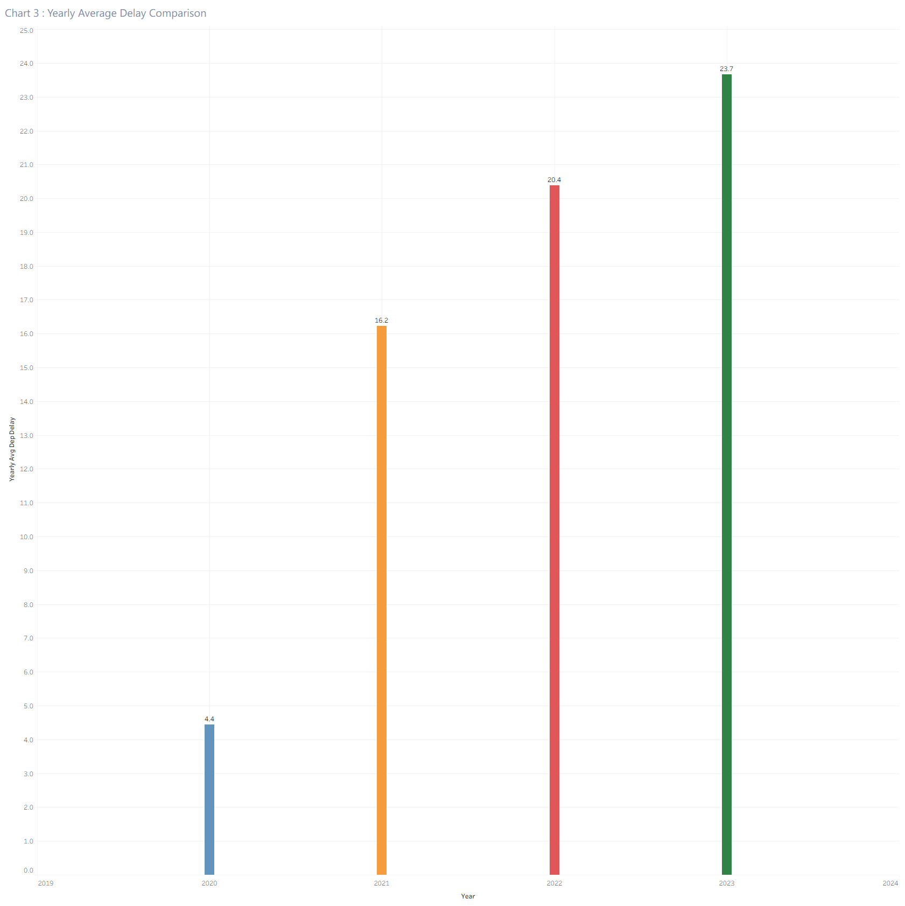
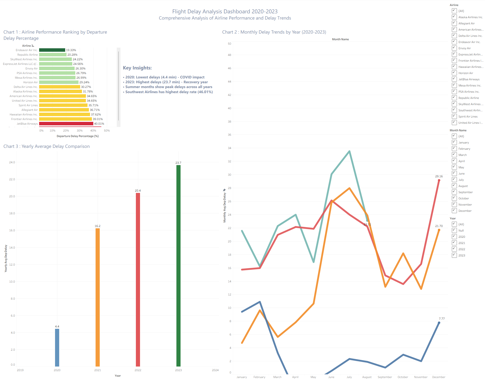

## 📊 Dashboard Results

### Chart 1: Airline Performance Ranking

*Top 12 airlines ranked by delay performance*

### Chart 2: Monthly Trends by Year

*Seasonal patterns and year-over-year comparison*

### Chart 3: Yearly Overview

*Annual delay trends comparison*

### Full Dashboard View

*Interactive dashboard with all visualizations*

## 🛠️ Local Setup Instructions

### Prerequisites
- PostgreSQL installed and running
- Tableau Desktop (or Tableau Public)
- Git for cloning the repository

### Step 1: Clone the Repository
```bash
git clone https://github.com/Tsishu/flight-delay-analysis-dashboard.git
cd flight-delay-analysis-dashboard
```

### Step 2: Set Up Database
1. **Create a new PostgreSQL database**
2. **Import your flight data** (CSV or SQL dump)
3. **Run the SQL scripts** in the `sql/` folder:
   ```sql
   -- Run this in your PostgreSQL database
   \i 'sql/flight_delay_analysis_complete.sql'
   ```

### Step 3: Export Data for Tableau
1. **Export the created tables** to CSV:**
   ```sql
   -- Note: Use absolute paths for Windows
   COPY airline_performance TO 'C:\path\to\your\project\data\airline_performance.csv' CSV HEADER;
   COPY monthly_delay_trends_clean TO 'C:\path\to\your\project\data\monthly_trends_clean.csv' CSV HEADER;
   COPY yearly_delay_overview TO 'C:\path\to\your\project\data\yearly_overview.csv' CSV HEADER;
   ```

   **Alternative: Use pgAdmin's export feature** (easier than COPY commands)
   - Right-click table → Export → CSV
   - Save to your project's data folder

### Step 4: Open in Tableau
1. **Open Tableau Desktop**
2. **Connect to the CSV files** in the `data/` folder
3. **Open the dashboard** from the `tableau/` folder
4. **Explore the interactive visualizations**

### Data Requirements
- **Original dataset**: US flight delay data (2019-2023)
- **Minimum size**: 100K+ flight records
- **Required columns**: fl_date, airline, dep_delay, arr_delay, etc.

### Troubleshooting
- **If COPY commands fail**: Use pgAdmin's built-in export feature
- **If paths don't work**: Use absolute file paths
- **If permissions denied**: Run PostgreSQL as administrator


